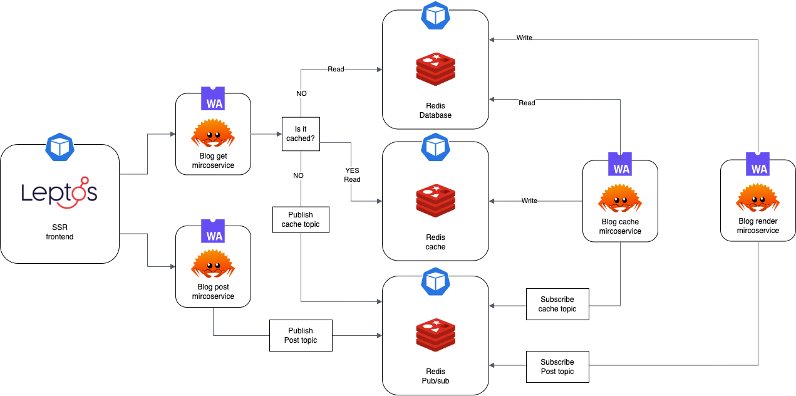
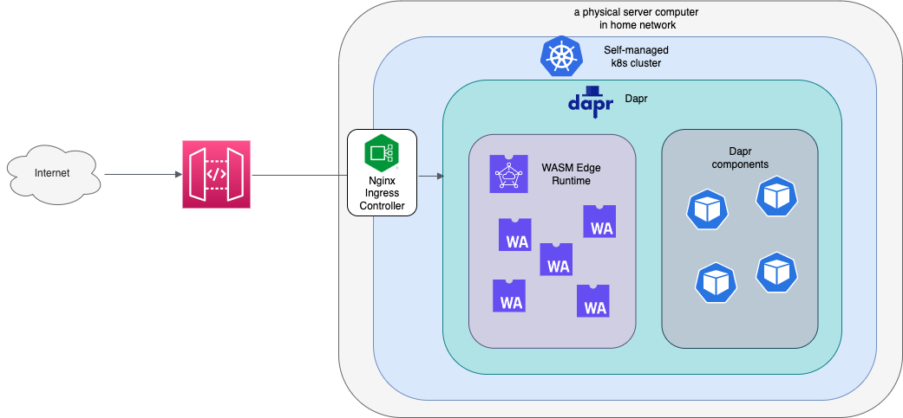

# WASM with rust
## Goal
The goal of this project is to play around with WASM on browser and servers.
The end product of this project is a full-stack web app for my blogs.

## Features
- Upload blog posts as markdown files
- Parse the markdown file and store the content in persistent layer
- Display blogs (server-side rendered)

## Tech stack 

### Frontend
- Leptos
### Backend
- Rust + wasmedge + Dapr
### Infra
- Everything will be deployed to self-hosted single-node Kubernetes cluster at home
  - server-side wasm components are deployed using wasmedge
  - frontend wasm components are deployed as linux containers to handle ssr
  - persistent layer will be deployed as linux containers
- service discovery will be handled by Dapr
- ingress will be handled by ingress controller
- To make it publically accessible, use AWS gateway as proxy

  
